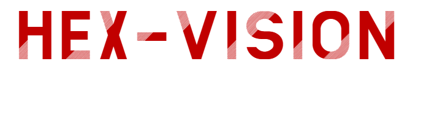

    

Realtime object segmentation and tracking with a control-focused UI. Built around screen capture, YOLOv8 segmentation, and telemetry visuals for robotics-style workflows.


## What it does

- Captures a user-defined RGB region and runs YOLOv8 segmentation.
- Displays live detections, threat matrix, and telemetry panels.
- Provides goal modes (avoid, follow, search) with configurable limits.
- Includes visual motor vector and predictive path widgets.
- Translates motion vector to mouse position for Chica Client controller app.

## Requirements

- Python 3.9+
- Windows 10/11 recommended
- A compatible GPU is optional but improves FPS

## Quick start

```powershell
python -m venv venv
.\venv\Scripts\Activate.ps1
pip install -r requirements.txt
python main.py
```

## Usage

1. Click "Set RGB Camera Zone" and drag to define the capture area.
2. (Optional) Set the depth and controller regions if you use them.
3. Choose a goal mode and target class.
4. Click "Start Vision" to begin tracking.
